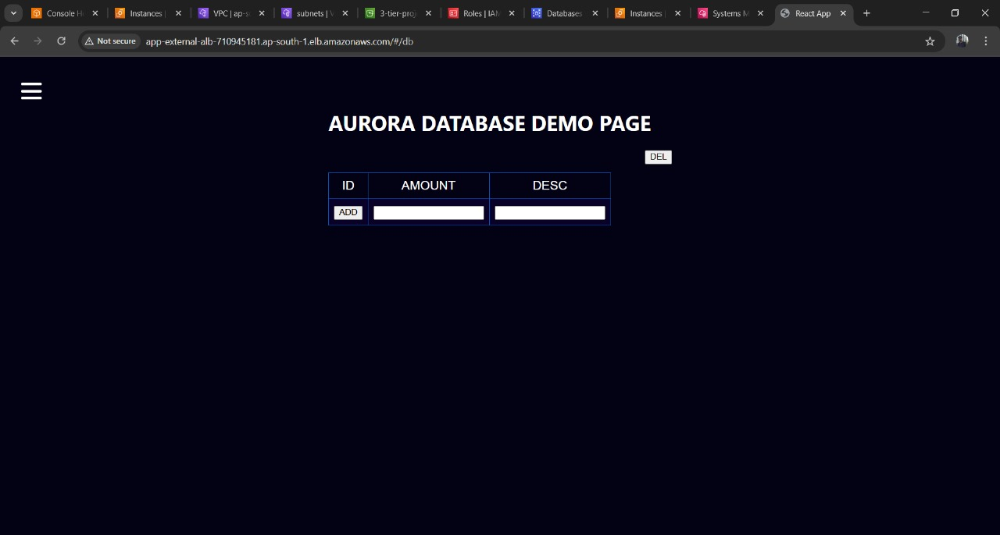

# 3-Tier Architecture Application Deployment on AWS

# Overview

This project implements a scalable 3-tier web application architecture on AWS with:

Web Tier (Presentation Layer): NGINX servers

Application Tier (Business Logic Layer): Node.js servers

Database Tier (Data Layer): MySQL RDS instance

# 1. VPC Setup
   --
   
    Create VPC with CIDR 192.168.0.0/16
 Configure with:
 - 2 Availability Zones
 - 2 Public Subnets
 - 4 Private Subnets (APP1, APP2, DB1, DB2)
 - 1 NAT Gateway
   
#2. Security Groups Configuration
---
   
*  Create these security groups with appropriate inbound rules:

*  WebALB-SG: Allow HTTP/HTTPS from anywhere (0.0.0.0/0)

*  Web-SG: Allow HTTP/HTTPS from WebALB-SG or VPC CIDR

*  AppALB-SG: Allow HTTP/HTTPS from Web-SG or VPC CIDR

*  App-SG: Allow custom TCP port 4000 from AppALB-SG or VPC CIDR

*  Database-SG: Allow MySQL from App-SG or VPC CIDR

#3. S3 Bucket Setup
   ---
   // Create private S3 bucket for application code
aws s3 mb s3://3-tier-project-demo --region your-region
// Upload application code
aws s3 sync ./application-code s3://3-tier-project-demo/application-code/

#4. IAM Role Creation
   ---
Create IAM role "3-tier-role" with:
Trusted Entity: EC2
Permissions: AmazonEC2RoleforSSM (for SSH-less access)

#5. RDS MySQL Database Setup
   ---
* First create DB subnet group with DB1 and DB2 subnets
* Then create RDS instance:
* - DB identifier: my3tierdb
* - Engine: MySQL
* - VPC: Your created VPC
* - Security Group: Database-SG
* - Credentials: admin/root123456
 
#6. Application Tier Deployment
   ---
1.Launch EC2 instance in private subnet APP1:

AMI: Amazon Linux 2/2023
Instance Type: t2.micro
Security Group: App-SG
IAM Role: 3-tier-role

2.Connect via Session Manager and install dependencies:

sudo yum install mysql -y
curl -o- https://raw.githubusercontent.com/nvm-sh/nvm/v0.39.0/install.sh | bash
source ~/.bashrc
nvm install 16
nvm use 16
npm install -g pm2

3.Download and setup application:

aws s3 cp s3://3-tier-project-demo/application-code/app-tier/ app-tier --recursive
cd app-tier
npm install
// Update DbConfig.js with RDS credentials
pm2 start index.js
pm2 startup
pm2 start index.js
pm2 startup

#7. Internal Load Balancer Setup
   ---
1.Create Target Group "App-TG":
*  Protocol: HTTP, Port: 4000
*  Health Check: /health
*  Register App Server instance
  
2.Create Internal Application Load Balancer "app-internal-alb":
*  Scheme: Internal
*  Listeners: HTTP:80 → App-TG

#8. Web Tier Deployment
   ---
 1.Launch EC2 instance in public subnet:
*  AMI: Amazon Linux 2/2023
*  Instance Type: t2.micro
*  Security Group: Web-SG
*  IAM Role: 3-tier-role

 2. Install and configure NGINX:
*  sudo dnf install -y nginx
*  aws s3 cp s3://3-tier-project-demo/application-code/nginx.conf /etc/nginx/
*  sudo systemctl restart nginx
*  sudo chkconfig nginx on

#  9. External Load Balancer Setup
      ---
1.Create Target Group "Web-TG":
*  Protocol: HTTP, Port: 80
*  Health Check: /
*  Register Web Server instance

2.Create Internet-facing Application Load Balancer "app-external-alb":
*  Scheme: Internet-facing
*  Listeners: HTTP:80 → Web-TG

 # 10. HTTPS Configuration
      ---
1.Request ACM certificate for your domain
2.Add HTTPS listener to external ALB with ACM certificate

 # 11. Auto Scaling Setup
    
1.Create AMIs of your App and Web servers
2.Create Launch Templates for both tiers
3.Configure Auto Scaling Groups:

*  App-ASG: 2-6 instances across APP1/APP2
*  Web-ASG: 2-6 instances across Public1/Public2

#  12. Route53 Configuration
      
Create DNS record (boom.reyazawstrainer.com) pointing to your external ALB

# Application Code Modifications

Before deployment, update these files:

1. app-tier/DbConfig.js - Add RDS endpoint and credentials
2. nginx.conf - Update proxy_pass with internal ALB DNS name

  # Validation Steps
   
1.  Test database connection from App Server
2.  Verify application health check: curl http://localhost:4000/health
3.  Test internal ALB endpoint
4.  Verify external ALB responds correctly
5.  Test complete flow through domain name

